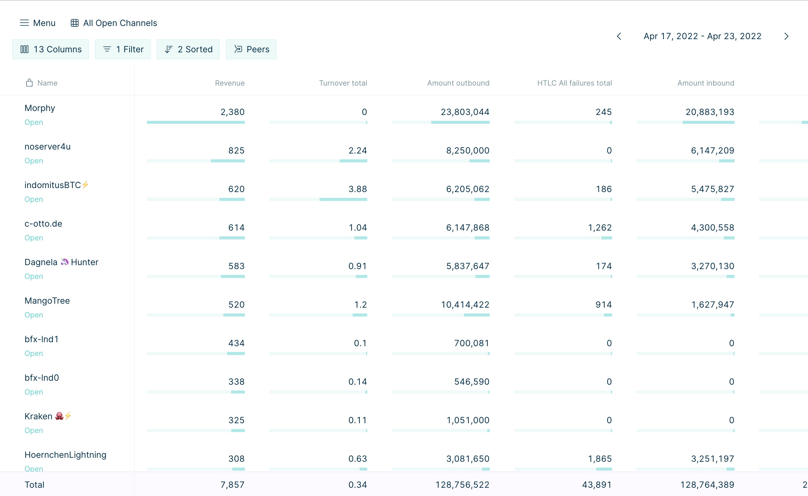

# Torq by LN.capital

Torq is a capital management tool for routing nodes on the lightning network.




Current features:
* Store all events from your node including HTLC events and channel enable/disable events.
* Group stats based on peer (public key) and tags (released soon)
* Filter data on any time frame
* Navigate through time (days, weeks, months) and track your progress
* Customize table views with a wide range of stats, filters sorting
* Store different table views to quickly switch between different stats and useful information.

Features on the roadmap:
* Support for CLN (C-lightning)
* Channel and Channel group inspection
* Advanced graphs
* Fee automation
* Automatic rebalancing based on advanced rules
* Limit HTLC amounts
* Automatic Backups
* Automatic channel tagging

Join our [Telegram group](https://t.me/joinchat/V-Dks6zjBK4xZWY0) for updates on releases
and feel free to ping us in the telegram group you have questions or need help getting started.
We would also love to hear your ideas for features or any other feedback you might have.

## Run With Docker

Torq can be run from a prebuilt docker image:

### Run TimescaleDB container

Optional step if you already have a PostgreSQL database with TimescaleDB plugin.
If not create one with the following command.

```sh
docker run -d --name timescaledb -p 5432:5432 \
-v <AbsoluteDataPath>:/var/lib/postgresql/data \
-e POSTGRES_PASSWORD=<DBPassword> timescale/timescaledb:latest-pg14
```

### Create a database and user for Torq

Shell into the timescale container to run `psql`.

```sh
docker exec -it timescaledb bash
psql -U postgres
```

Inside the postgres interactive terminal run the following three SQL commands to
create a database and user.

```postgresql
CREATE DATABASE torq;
CREATE USER torq WITH ENCRYPTED PASSWORD '<DBPassword>';
GRANT ALL PRIVILEGES ON DATABASE torq TO torq;
```

After creating the database, exit psql and the TimescaleDB container by hitting `CTRL d` twice.

### Run Torq

At present Torq only connects to a single LND node. To run Torq provide the IP, Port, TLS cert and
Macaroon of your LND Node as well as the database password set above and a frontend password of your choice.
Database name and user are configurable but both default to `torq`.


```sh
docker run -p 8080:8080 --rm  \
--add-host=host.docker.internal:host-gateway \
-v <AbsolutePathLNDTLSCert>:/app/tls.cert \
-v <AbsolutePathLNDMacaroon>:/app/readonly.macaroon \
lncapital/torq \
--lnd.macaroon /app/readonly.macaroon \
--lnd.tls /app/tls.cert \
--db.host host.docker.internal \
--lnd.node_address <IP:Port of LND Node e.g. 190.190.190.190:10009> \
--db.password <DBPassword> \
--torq.password <ChooseYourFrontendPassword> \
start
```
