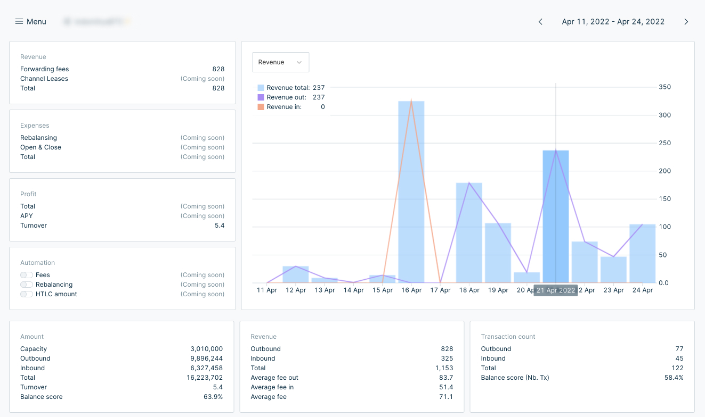
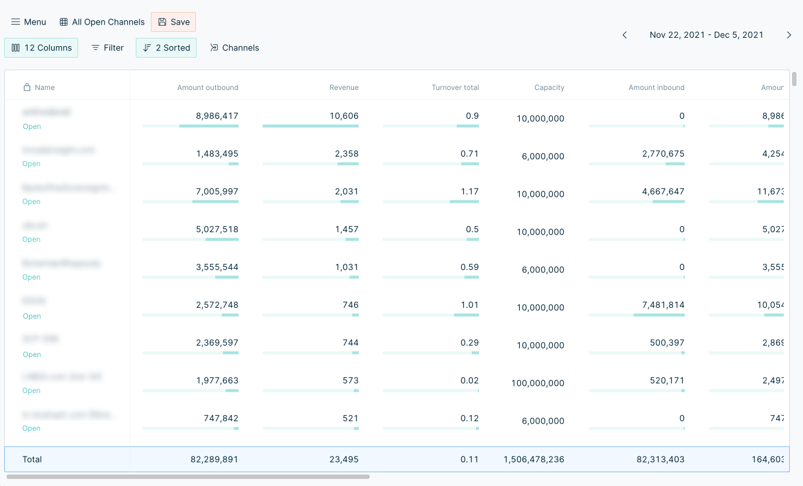

# Torq by LN.capital

Torq is a capital management tool for routing nodes on the lightning network.

## Quick start

To install Torq follow one of the simple guides here
https://docs.ln.capital/

## Current features

- Channel and Channel group inspection
- Advanced charts and visualizations of aggregated forwarding statistics.
- Visualization of sources and destinations for traffic.
- Stores all events from your node including HTLC events, fee rate changes and channel enable/disable events.
- Filter, sort and group data
- Store custom table views configurations for quickly finding the right information.
- Fetch and analyse data from any point in time.
- Navigate through time (days, weeks, months) to track your progress.

### Features on the roadmap

- Support for CLN (C-lightning)
- Fee automation
- Automatic rebalancing based on advanced rules
- Limit HTLC amounts
- Automatic Backups
- Automatic channel tagging

## Join us!
Join our [Telegram group](https://t.me/joinchat/V-Dks6zjBK4xZWY0) for updates on releases
and feel free to ping us in the telegram group you have questions or need help getting started.
We would also love to hear your ideas for features or any other feedback you might have.

## Preview

